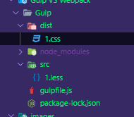
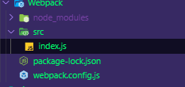
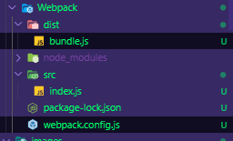

# Gulp VS Webpack

[toc]

---

自动化的事情应该交由构建工具来做，时下流行的前端构建工具有 gulp 和 webpack。本文主要分析他们的优势短缺和适用场景，从而更好地构建前端开发流程。

---

## Gulp

Gulp中文官网 主标题：`用自动化构建工具增强你的工作流程！` 副标题：gulp 将开发流程中让人**痛苦或耗时**的任务自动化，从而减少你所浪费的时间、创造更大价值。

想一想咱们日常的开发工作中痛苦又耗时任务有哪些呢？

- 编译用 es6，typescript 编写的脚本文件成浏览器认识的 javascript
- 编译用 scss，less 编写的样式文件成浏览器认识的 css
- 检查代码是否规范
- 单元测试和集成测试
- 生产环境部署代码需要压缩合并静态文件，添加文件版本控制缓存
- 等等其他任务

 ### gulp如何帮我们实现自动化

 作为一个 node 包，标准打开方式当然是：

```shell
npm i -g gulp
```
 
这里以编译 less 为例，首先安装编译 less 需要用到的 node 包：

```shell
npm i --save-dev gulp gulp-less
```

> ### 前面已经全局安装过 gulp 了，怎么又本地安装了一遍
>前面的 `-g` 是全局安装，是为了执行你所编写的 gulp 任务，即 `gulp yourTask`。而后面的 `--save-dev` 是本地安装，是为了咱们编写任务时使用 gulp 提供的 api，例如 `gulp.src()`、`gulp.task()`、`gulp.dest()` 等等。当然也是可以直接使用全局安装的 gulp 的 api 的，但是强烈不推荐，因为这样涉及到 gulp 版本控制的问题，而且使用全局 gulp 的 api 的话就会产生环境依赖（你假设环境已经全局安装了gulp，万一没装呢，程序不就出错了）。

接着在项目的根目录下新建一个 **gulpfile.js** 文件，这是 gulp 的默认配置文件。

> ### gulpfile.js 必须放在项目根目录？
>当然也可放在其他目录，但这样的话就得在启动 gulp 任务时手动指定 gulp 配置文件 `gulp yourTask --gulpfile GulpfilePath`，可能还需要全局安装 gulp-cli，所以除非有特殊需要，否则就放在项目根目录就行了，这样最简单。

> ### 配置文件的名字必须是 gulpfile.js 吗？
>不区分大小写，取成 GULPFILE.js 的话 gulp 也能认识，只要 toLowerCase 之后是 gulpfile 就行了，如果取其它名字那你就又得使用 `--gulpfile` 选项去指定了。


现在工程目录结构已经成了下面的样子：


接下来就是在 `gulpfile.js` 里编写 gulp task（gulp 把为每个痛苦又耗时任务编写的处理方法称为一个 task）：

```js
const gulp = require('gulp');
const less = require('gulp-less');

gulp.task('build:less', function(){
    return gulp.src('./src/*.less')
        .pipe(less())
        .pipe(gulp.dest('./dist'));
});
```
 
最后就是打开一个终端，在终端里运行 `gulp build:less`。好了，编译后的文件已经被输出到了 dist 目录：



这基本上就是 gulp 的全部内容。这也是 gulp 的突出特点——易于学习，易于使用，五分钟成砖家。如果想要执行解决其他痛苦又耗时的任务，只需下载安装对应的 gulp 插件包，然后依次类推写一个 gulp.task 出来就行了。

> ### Gulp 是基于流的？
>流（Stream）不是 gulp 创造的概念，而是从 unix 时代就开始使用的 I/O 机制，一直到现在仍在广泛使用。Node 封装了一个 stream 模块专门用来对流进行操作。gulp 所基于的流即是 Node 封装起来的 stream。上面 gulp.task() 代码里面的 pipe 方法并不是 gulp 提供的 api，而是 node 的 api，准确的说应该是 node 的 stream 模块提供的 api。具体是怎么实现的呢：gulp.src() 的返回值是 node Stream 的一个实例，之后的 pipe 调用的其实是这个实例的 pipe 方法，而 pipe 方法的返回值依然是 node Stream 实例，以此实现前面的 .pipe().pipe().pipe() 这种串联写法。熟悉 jQuery 的同学应该很清楚这种技巧。

---

## Webpack

gulp 似乎是完美的，对前端开发工作中每一项痛苦又耗时任务都能见招拆招，各个击破。然而前端发展速度之快超乎想象，对页面性能和用户体验更是追求极致，以至于 gulp 某些领域尤其大型 SPA（单页应用）显得有些不够用了：

- 单页应用的核心是模块化，ES6 之前 JavaScript 语言本身一直是没有模块系统的，导致 AMD，CMD，UMD 各种轮子模块化方案都蹦出来。对这种模块化乱象，gulp 显得无能为力，gulp 插件对这一块也没有什么想法。不过也可以理解，模块化解决方案可不是谁都能 hold 住的，需要考虑的问题太多了；
- 对前沿的 SPA 技术 gulp 处理起来显得有些力不从心，例如 Vue 的单文件组件，gulp 配合一些插件可以勉强处理，但是很蹩脚。其实归根结底，还是模块化处理方面的不足；
- 优化页面加载速度的一条重要法则就是减少 http 请求。gulp 只是对静态资源做流式处理，处理之后并未做有效的优化整合，也就是说 gulp 忽略了系统层面的处理，这一块还有很大的优化空间，尤其是移动端，那才真的是一寸光阴一寸金啊，哪怕是几百毫秒的优化所带来的收益（用户？流量？付费？）绝对超乎你的想象。别跟我说 gulp-concat，CSS Sprites，这俩玩意儿小打小闹还行，遇上大型应用根本拿不上台面。现在的页面动辄上百个零碎资源（图片，样式表，脚本），也就是上百个 http 请求，因此这个优化需求还是相当迫切的。关于为何减少 http 请求可以有效降低页面加载时间戳这里。
- 你自己想吧，主要就是大型单页应用方面有短板；

Webpack 是当下最热门的前端资源模块化 管理和打包 工具。它可以将许多松散的模块按照依赖和规则打包成符合生产环境部署的前端资源。还可以将按需加载的模块进行代码分割，等到实际需要的时候再异步加载。

webpack “万物皆模块” 的理念和 SPA 配合起来简直是金童玉女，天作之合。这也是 webpack 短时间内名声大噪，直接撼动 gulp 地位的主要原因。

webpack 的理念比较前卫，它本身也带来了很多新的概念和内容，诸如加载器（loader）、依赖图（Dependency Graph）等等。和 gulp 两小时成砖家的学习难度相比，webpack 或许你研究两天仍然会晕头转向。

接下来简单看一下 webpack 的主要工作方式。

webpack 和 gulp 一样也是一个小 node 包，打开方式自然是：

```shell
npm i -g webpack
npm i --save-dev webpack
```

和 gulp 一样，全局安装是为了执行 webpack 任务，本地安装是为了使用 webpack 提供的 api。

安装完 webpack 之后在项目根目录下新建一个 webpack.config.js，这是 webpack 的默认配置文件，同 gulp 的 gulpfile.js 的功能类似。webpack.config.js 同样是不区分大小写的，取成 webPACk.CONfig.js 的话 webpack 也能认识，但是取成其他名字或放在别的目录就需要使用 --config 选项去指定配置文件了。

现在工程目录结构如下：



接下来就是在 webpack.config.js 里配置需要的选项，注意了，webpack 与 gulp 的重要不同就是使用方式 由编程式变成了配置式：

```js
const path = require('path');

module.exports = {
    entry: './src/index.js',        // 告诉 webpack 你要编译哪个文件
    output: {                       // 告诉 webpack 你要把编译后生成的文件放在哪
        filename: 'bundle.js',
        path: path.join(__dirname, 'dist')
    }
};
```

最后仍然和 gulp 类似，就是在终端里运行 webpack（终端里一般会出现一大坨编译信息）。好了，现在 webpack 已经把编译好的文件输出到了 dist 目录：



看到这是不是已经一头雾水了，在你还没明白发生了什么的时候 webpack 已经把事情干完了。这也是 webpack 和 gulp 作业方式的重要不同：Gulp 是搭了个台子，让 gulp 插件在上面唱戏，尽情表演，所有构建相关的具体事情都交由 gulp 插件去做。而 Webpack 就牛逼了，webpack 先搭了个台子，然后自己在上面唱嗨了，仔细一听，他在上面唱的是《我们不一样》，当然了他也是让 webpack 插件在上面唱戏的。

也就是说 webpack 把很多功能都封装进了自己身体里面，使得自己强大同时臃肿。现在你可以在 ./src/index.js 文件里直接写 ES6 代码，因为 webpack 把编译 ES6 的工作已经封装到自己的实现里了，使得 webpack 看起来原生支持 ES6 而不需要借助第三方插件，其实他内部也是用了第三方插件的，所以你不用再专门去下一个 babel 之类的插件去转译 ES6。这样封装的好处是使用起来很方便，不好的地方就是使用者完全不知道发生了什么，构建完了还一脸懵逼。

上面仅是 webpack 使用的最最最简单示例，简直连 “hello world” 都算不上。具体怎样打包各种资源（typescript，样式表，图片，字体等等）可前往 webpack官网 深入学习，想看中文的同学使劲 戳这里。

webpack “一切皆模块” 的特点完美解决了上面 gulp 暴露的几个短板，连 webpack 官网也说自己是因为看到现存的模块打包器都不太适合大型 SPA 应用，于是决定打造一个适合大型 SPA 应用的模块打包器，也就是说 webpack 其实就是为大型 SPA 而生的。

webpack 怎么实现像 gulp 一样对大量源文件进行流式处理
人家 webpack 本来就没打算做这事。webpack 不是以取代 gulp 为目的的，而是为了给大型 SPA 提供更好的构建方案。对大量源文件进行流式处理是 gulp 擅长的事，webpack 不想抢，也没必要抢。即使抢，也无非是再造一个蹩脚的 gulp 出来而已。

既然 webpack 模块化这么强，那以后模块化就全用 webpack 好了
webpack 模块化是强，但是他胖啊，不是所有人都抱得动，主要是他为了提供更多的功能封装进了太多东西，所以选择上还是需要因地制宜。如果单纯只是打包 js（多页应用往往是这种需求），完全可以使用 rollup，browserify 这种小而美的实现，因为他们只做一件事——打包js。而如果需要将图片，样式，字体等所有静态资源全部打包，webpack 毫无疑问是首选。这也是为什么越来越多的流行库和框架开始从 webpack 转向使用 rollup 进行打包，因为他们只需要打包 js，webpack 好多强大功能根本用不到。连 [rollup 官网](https://www.rollupjs.com/)也坦言如果你在构建一个库，rollup 绝对是首选，但如果是构建一个应用，那么请选 webpack。

## 结论

我看好多人说 gulp 和 webpack 不是一类东西，我不这么觉得，虽然说两者的出发点确实是不一样的，gulp 走的是流式处理路线，webpack 走的是模块处理路线，但是两者所要达成的目标却是一样的，那就是促进前端领域的自动化和工程化管理。webpack 发展到现在，已经非常强大了，强大到在构建方面 gulp 能做的事 webpack 基本上都可以胜任，gulp 做不了的 webpack 也能搞。同样的那些开发工作中痛苦又耗时的任务，gulp 和 webpack 都能解决，只是解决思路有天壤之别。

### 下表是从各个角度对 gulp 和 webpack 做的对比：

|	| Gulp | Webpack 
| - | - | -
| 定位 | 基于流的自动化构建工具 | 一个万能模块打包器 
| 目标 | 自动化和优化开发工作流，为通用 website 开发而生 | 通用模块打包加载器，为移动端大型 SPA 应用而生
| 学习难度 | 易于学习，易于使用，api总共只有5个方法 | 有大量新的概念和api，不过好在有详尽的官方文档
| 适用场景 | 基于流的作业方式适合多页面应用开发 | 一切皆模块的特点适合单页面应用开发
| 作业方式 | 对输入（gulp.src）的 js，ts，scss，less 等源文件依次执行打包（bundle）、编译（compile）、压缩、重命名等处理后输出（gulp.dest）到指定目录中去，为了构建而打包	| 对入口文件（entry）递归解析生成依赖关系图，然后将所有依赖打包在一起，在打包之前会将所有依赖转译成可打包的 js 模块，为了打包而构建
| 使用方式 | 常规 js 开发，编写一系列构建任务（task）。 | 编辑各种 JSON 配置项
| 优点 | 适合多页面开发，易于学习，易于使用，接口优雅。 | 可以打包一切资源，适配各种模块系统
| 缺点 | 在单页面应用方面输出乏力，而且对流行的单页技术有些难以处理（比如 Vue 单文件组件，使用 gulp 处理就会很困难，而 webpack 一个 loader 就能轻松搞定） | 不适合多页应用开发，灵活度高但同时配置很繁琐复杂。“打包一切” 这个优点对于 HTTP/1.1 尤其重要，因为所有资源打包在一起能明显减少浏览器访问页面时的资源请求数量，从而减少应用程序必须等待的时间。但这个优点可能会随着 HTTP/2 的流行而变得不那么突出，因为 HTTP/2 的多路复用可以有效解决客户端并行请求时的瓶颈问题。
| 结论 | 浏览器多页应用(MPA)首选方案 | 浏览器单页应用(SPA)首选方案

## 参考文章
[前端构建工具之争——Webpack vs Gulp 谁会被拍死在沙滩上](https://www.cnblogs.com/iovec/p/7921177.html)