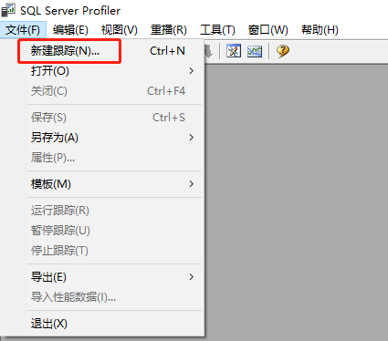
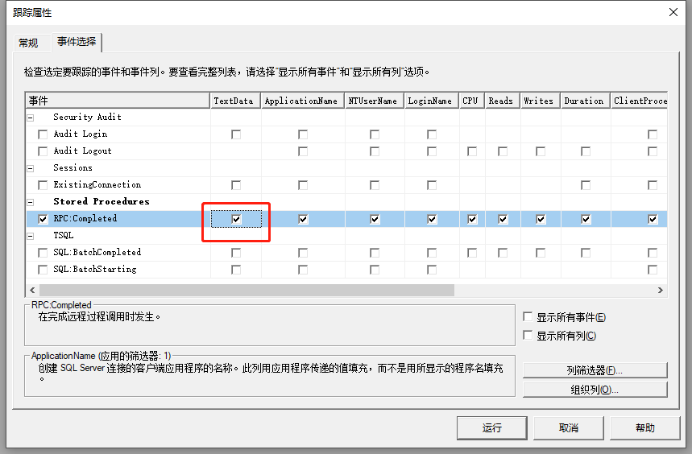
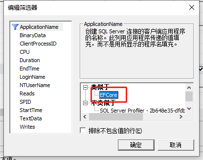
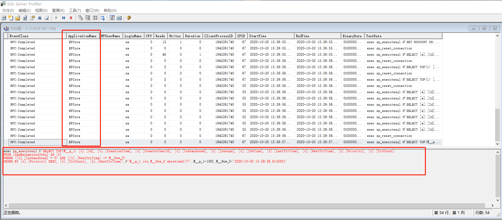

# 数据库性能优化

## SQL Server Profiler 查看EFCore生成的SQL

1. 在项目appsettings.json中的数据库连接字符串中追加`App=EFCore;`，其中**EFCore**可以随便写。
2. 启动SQL Server Profiler,主界面点击左上角的**文件**，连接到服务器。
3. 在弹出的界面中切换到选项卡**事件选择**，除**RPC:Completed**之外全部都不选，记得勾上**TextData**列，点击右下角的**列筛选器**。
4. 在弹出的**编辑筛选器**界面的第一个**ApplicationName**的*类似于*中加上`EFCore`，点击**确认**,关闭弹窗。
5. 点击**运行**，可以看到SQLServer执行的EFCore生产的SQL。









[^_^]:
    [EFCore 5.0将支持LogTo方法输出SQL](https://docs.microsoft.com/en-us/ef/core/miscellaneous/events/simple-logging)

```csharp
protected override void OnConfiguring(DbContextOptionsBuilder optionsBuilder)
    => optionsBuilder.LogTo(Console.WriteLine);
```

## 索引


参考文章：[聚集索引与非聚集索引](https://www.cnblogs.com/s-b-b/p/8334593.html)

索引是关系型数据库中给数据库表中一列或多列的值排序后的存储结构，SQL的主流索引结构有B+树以及Hash结构，聚集索引以及非聚集索引用的是B+树索引。

SQL Server索引类型：

- 唯一索引
- 主键索引
- 聚集索引
- 非聚集索引

MySQL索引类型：

- 唯一索引
- 主键（聚集）索引
- 非聚集索引
- 全文索引

### 唯一索引

    定义：唯一的索引意味着两个行不能拥有相同的索引值。

Sql Server、MySQL：

```sql
CREATE UNIQUE INDEX index_name ON table_name (column_name [ASC|DESC],column_name1 [ASC|DESC])
```

### 主键索引

- PRIMARY KEY 约束唯一标识数据库表中的每条记录。

- 主键必须包含唯一的值。

- 主键列不能包含 NULL 值。

- 每个表都应该有一个主键，并且每个表只能有一个主键。

下面的 SQL 在 "Persons" 表创建时在 "Id_P" 列创建 PRIMARY KEY 约束：

MySQL:

```sql
CREATE TABLE Persons
(
    Id_P int NOT NULL,
    LastName varchar(255) NOT NULL,
    FirstName varchar(255),
    Address varchar(255),
    City varchar(255),
    PRIMARY KEY (Id_P)
)
```

SQL Server：

```sql
CREATE TABLE Persons
(
    Id_P int NOT NULL PRIMARY KEY,
    LastName varchar(255) NOT NULL,
    FirstName varchar(255),
    Address varchar(255),
    City varchar(255)
)
```

如果需要命名 PRIMARY KEY 约束，以及为多个列定义 PRIMARY KEY 约束，请使用下面的 SQL 语法：

SQL Server、MySQL：

```sql
CREATE TABLE Persons
(
    Id_P int NOT NULL,
    LastName varchar(255) NOT NULL,
    FirstName varchar(255),
    Address varchar(255),
    City varchar(255),
    CONSTRAINT pk_PersonID PRIMARY KEY (Id_P,LastName)
)
```

### 聚集索引

聚集（clustered）索引，也叫聚簇索引。

    定义：数据行的物理顺序与列值（一般是主键的那一列）的逻辑顺序相同，一个表中只能拥有一个聚集索引。

在数据库中的样子：

| 地址 | id | username | score |
| -- | -- | -- | -- |
| 0x01 | 1 | 小明 | 90 |
| 0x02 | 2 | 小红 | 80 |
| 0x03 | 3 | 小华 | 92 |
| ..   | ..| ..  |..  |
| 0xff |256|小英  | 70 |

注：第一列的地址表示该行数据在磁盘中的物理地址，后面三列才是我们SQL里面用的表里的列，其中id是主键，建立了聚集索引。

结合上面的表格就可以理解这句话了吧：数据行的物理顺序与列值的顺序相同，如果我们查询id比较靠后的数据，那么这行数据的地址在磁盘中的物理地址也会比较靠后。而且由于物理排列方式与聚集索引的顺序相同，所以也就只能建立一个聚集索引了。


聚集索引实际存放的示意图

从上图可以看出聚集索引的好处了，索引的叶子节点就是对应的数据节点（MySQL的MyISAM除外，此存储引擎的聚集索引和非聚集索引只多了个唯一约束，其他没什么区别），可以直接获取到对应的全部列的数据，而非聚集索引在索引没有覆盖到对应的列的时候需要进行二次查询，后面会详细讲。因此在查询方面，聚集索引的速度往往会更占优势。

#### 创建聚集索引

如果不创建索引，系统会自动创建一个隐含列作为表的聚集索引。

1.创建表的时候指定主键（注意：SQL Sever默认主键为聚集索引，也可以指定为非聚集索引，而MySQL里主键就是聚集索引）

```sql
create table t1(
    id int primary key,
    name nvarchar(255)
)
```

2.创建表后添加聚集索引

SQL Server

```sql
create clustered index clustered_index on table_name(colum_name)
```

MySQL

```sql
alter table table_name add primary key(colum_name)
```

最好在创建表的时候添加聚集索引，由于聚集索引的物理顺序上的特殊性，因此如果再在上面创建索引的时候会根据索引列的排序移动全部数据行上面的顺序，会非常地耗费时间以及性能。

### 非聚集索引

非聚集（unclustered）索引。

    定义：该索引中索引的逻辑顺序与磁盘上行的物理存储顺序不同，一个表中可以拥有多个非聚集索引。

其实按照定义，除了聚集索引以外的索引都是非聚集索引，只是人们想细分一下非聚集索引，分成普通索引，唯一索引，全文索引。如果非要把非聚集索引类比成现实生活中的东西，那么非聚集索引就像新华字典的偏旁字典，他结构顺序与实际存放顺序不一定一致。


非聚集索引实际存放的示意图

#### 非聚集索引的二次查询问题

非聚集索引叶节点仍然是索引节点，只是有一个指针指向对应的数据块，此如果使用非聚集索引查询，而查询列中包含了其他该索引没有覆盖的列，那么他还要进行第二次的查询，查询节点上对应的数据行的数据。

如有以下表t1：

| id |username | score |
| -- | -- | --|
1|小明|90
2|小红|80
3|小华|92
..|..|..
256|小英|70

以及聚集索引clustered index(id), 非聚集索引index(username)。

使用以下语句进行查询，不需要进行二次查询，直接就可以从非聚集索引的节点里面就可以获取到查询列的数据。

```sql
select id, username from t1 where username = '小明'
select username from t1 where username = '小明'
```

但是使用以下语句进行查询，就需要二次的查询去获取原数据行的score：

```sql
select username, score from t1 where username = '小明'
```

### 聚合索引和非聚合索引总结

1、索引建立场景：

| 动作描述 | 使用聚集索引 | 使用非聚集索引 |
| -- | -- | -- |
列经常被分组排序 | 应 | 应
返回某范围内的数据 | 应 |不应
一个或极少不同值 | 不应| 不应
小数目的不同值| 应 |不应
大数目的不同值 |不应| 应
频繁更新的列 |不应 |应
外键列 | 应 | 应
主键列 | 应 |应
频繁修改索引列 |不应 | 应

### 索引的不足之处

过多的使用索引将会造成滥用。因此索引也会有它的缺点：

◆虽然索引大大提高了查询速度，同时却会降低更新表的速度，如对表进行INSERT、UPDATE和DELETE。因为更新表时，不仅要保存数据，还要保存一下索引文件。

◆建立索引会占用磁盘空间的索引文件。一般情况这个问题不太严重，但如果你在一个大表上创建了多种组合索引，索引文件的会膨胀很快。

索引只是提高效率的一个因素，如果有大数据量的表，就需要花时间研究建立最优秀的索引，或优化查询语句。

### 使用索引的注意事项

◆索引不会包含有NULL值的列

只要列中包含有NULL值都将不会被包含在索引中，复合索引中只要有一列含有NULL值，那么这一列对于此复合索引就是无效的。所以我们在数据库设计时不要让字段的默认值为NULL。

◆使用短索引

对字符串列进行索引，如果可能应该指定一个前缀长度。例如，如果有一个CHAR(255)的列，如果在前10个或20个字符内，多数值是惟一的，那么就不要对整个列进行索引。短索引不仅可以提高查询速度而且可以节省磁盘空间和I/O操作。

## 执行计划

### SQL Server 执行计划

[SQL Server执行计划详解](https://www.cnblogs.com/knowledgesea/p/5005163.html)
[看懂SqlServer查询计划](https://www.cnblogs.com/fish-li/archive/2011/06/06/2073626.html)

### MySQL 执行计划

[MySQL执行计划详解](https://mp.weixin.qq.com/s/rX5M4DJwYHnUXj4GsFwfiQ)

## 写好SQL

1. 对查询进行优化，应尽量避免全表扫描，首先应考虑在 where 及 order by 涉及的列上建立索引。
2. 应尽量避免在 where 子句中使用!=或<>操作符，否则将引擎放弃使用索引而进行全表扫描。
3. 应尽量避免在 where 子句中对字段进行 null 值判断，否则将导致引擎放弃使用索引而进行全表扫描，如：

    ```sql
    select id from t where num is null
    ```

    可以在num上设置默认值0，确保表中num列没有null值，然后这样查询：

    ```sql
    select id from t where num=0
    ```

4. 应尽量避免在 where 子句中使用 or 来连接条件，否则将导致引擎放弃使用索引而进行全表扫描，如：

    ```sql
    select id from t where num=10 or num=20
    ```

    可以这样查询：

    ```sql
    select id from t where num=10 union all select id from t where num=20
    ```

5. 下面的查询也将导致全表扫描：

    ```sql
    select id from t where name like '%abc%'
    ```

    若要提高效率，可以考虑全文检索。

6. `in` 和 `not in` 也要慎用，否则会导致全表扫描，如：

    ```sql
    select id from t where num in(1,2,3)
    ```

    对于连续的数值，能用 `between` 就不要用 `in` 了：

    ```sql
    select id from t where num between 1 and 3
    ```

7. 如果在 where 子句中使用参数，也会导致全表扫描。因为SQL只有在运行时才会解析局部变量，但优化程序不能将访问计划的选择推迟到运行时；它必须在编译时进行选择。然而，如果在编译时建立访问计划，变量的值还是未知的，因而无法作为索引选择的输入项。如下面语句将进行全表扫描：

    ```sql
    select id from t where num=@num
    ```

    可以改为强制查询使用索引：

    ```sql
    select id from t with(index(索引名)) where num=@num
    ```

8. 应尽量避免在 where 子句中对字段进行表达式操作，这将导致引擎放弃使用索引而进行全表扫描。如：

    ```sql
    select id from t where num/2=100
    ```

    应改为:

    ```sql
    select id from t where num=100*2
    ```

9. 应尽量避免在where子句中对字段进行函数操作，这将导致引擎放弃使用索引而进行全表扫描。如：

    ```sql
    select id from t where substring(name,1,3)='abc'--name以abc开头的id select id from t where datediff(day,createdate,'2005-11-30')=0--'2005-11-30'生成的id
    ```

    应改为:

    ```sql
    select id from t where name like 'abc%'select id from t where createdate>='2005
    ```

10. 不要在 where 子句中的“=”左边进行函数、算术运算或其他表达式运算，否则系统将不能正确使用索引。

11. 在使用索引字段作为条件时，如果该索引是复合索引，那么必须使用到该索引中的第一个字段作为条件时才能保证系统使用该索引，否则该索引将不会被使用，并且应尽可能的让字段顺序与索引顺序相一致。

    此处为索引的"最左匹配原则"。

12. 不要写一些没有意义的查询，如需要生成一个空表结构：

    ```sql
    select col1,col2 into #t from t where 1=0
    ```

    注：构建测试数据生成大量数据的临时表时可以使用，记得销毁。

    这类代码不会返回任何结果集，但是会消耗系统资源的，应改成这样：
    
    ```sql
    create table #t(...)
    ```

1. 很多时候用 exists 代替 in 是一个好的选择：

    ```sql
    select num from a where num in (select num from b)
    ```
    用下面的语句替换：

    ```sql
    select num from a where exists (select 1 from b where num=a.num)
    ```

14. 并不是所有索引对查询都有效，SQL是根据表中数据来进行查询优化的，当索引列有大量数据重复时，SQL查询可能不会去利用索引，如一表中有字段sex，male、female几乎各一半，那么即使在sex上建了索引也对查询效率起不了作用。

15. 索引并不是越多越好，索引固然可以提高相应的 select 的效率，但同时也降低了 insert 及 update 的效率，因为 insert 或 update 时有可能会重建索引，所以怎样建索引需要慎重考虑，视具体情况而定。一个表的索引数最好不要超过6个，若太多则应考虑一些不常使用到的列上建的索引是否有必要。

16. 应尽可能的避免更新 clustered 索引数据列，因为 clustered 索引数据列的顺序就是表记录的物理存储顺序，一旦该列值改变将导致整个表记录的顺序的调整，会耗费相当大的资源。若应用系统需要频繁更新 clustered 索引数据列，那么需要考虑是否应将该索引建为 clustered 索引。

17. 尽量使用数字型字段，若只含数值信息的字段尽量不要设计为字符型，这会降低查询和连接的性能，并会增加存储开销。这是因为引擎在处理查询和连接时会逐个比较字符串中每一个字符，而对于数字型而言只需要比较一次就够了。

18. 尽可能的使用 varchar/nvarchar 代替 char/nchar ，因为首先变长字段存储空间小，可以节省存储空间，其次对于查询来说，在一个相对较小的字段内搜索效率显然要高些。

19. 任何地方都不要使用 `select * from t` ，用具体的字段列表代替“*”，不要返回用不到的任何字段。

    SQLServer会导致Key Lookup（二次查询），性能很慢。

20. 尽量使用表变量来代替临时表。如果表变量包含大量数据，请注意索引非常有限（只有主键索引）。

21. 避免频繁创建和删除临时表，以减少系统表资源的消耗。

22. 临时表并不是不可使用，适当地使用它们可以使某些例程更有效，例如，当需要重复引用大型表或常用表中的某个数据集时。但是，对于一次性事件，最好使用导出表。

23. 在新建临时表时，如果一次性插入数据量很大，那么可以使用 select into 代替 create table，避免造成大量 log ，以提高速度；如果数据量不大，为了缓和系统表的资源，应先create table，然后insert。

2. 如果使用到了临时表，在存储过程的最后务必将所有的临时表显式删除，先 truncate table ，然后 drop table ，这样可以避免系统表的较长时间锁定。

25. 尽量避免使用游标，因为游标的效率较差，如果游标操作的数据超过1万行，那么就应该考虑改写。

26. 使用基于游标的方法或临时表方法之前，应先寻找基于集的解决方案来解决问题，基于集的方法通常更有效。

27. 与临时表一样，游标并不是不可使用。对小型数据集使用 FAST_FORWARD 游标通常要优于其他逐行处理方法，尤其是在必须引用几个表才能获得所需的数据时。在结果集中包括“合计”的例程通常要比使用游标执行的速度快。如果开发时间允许，基于游标的方法和基于集的方法都可以尝试一下，看哪一种方法的效果更好。

28. 在所有的存储过程和触发器的开始处设置 SET NOCOUNT ON ，在结束时设置 SET NOCOUNT OFF 。无需在执行存储过程和触发器的每个语句后向客户端发送 DONE_IN_PROC 消息。

29. 尽量避免向客户端返回大数据量，若数据量过大，应该考虑相应需求是否合理。

30. 尽量避免大事务操作，提高系统并发能力。

### 新特性

#### Json

适用于： SQL Server 2016 及更高版本,MySQL 5.7 及更高版本

SQL Server：

```sql
SELECT JSON_QUERY(Properties,'$.address'),JSON_VALUE(Properties,'$.address.city') FROM People WHERE Id<1000
```

MySQL：

```sql
SELECT c, c->"$.id", g FROM jemp WHERE c->"$.id" > 1 ORDER BY c->"$.name"
```

```sql
SELECT c, JSON_EXTRACT(c, "$.id"), g FROM jemp WHERE JSON_EXTRACT(c, "$.id") > 1 ORDER BY JSON_EXTRACT(c, "$.name");
```

#### Index Building Filter(索引创建时过滤)

适用于： SQL Server

有一些索引非常低效的，比如经常查询状态为进行中的订单，订单有99%的状态是完成，1%是进行中 ，因此我们在订单状态字段上建了一个索引，性能是提高了，但是感觉索引中保存了99%的完成状态数据是永远不会查询到的，很浪费空间。如果我们的索引在建立的时间就不保存完成状态的数据，那不是更好。 Index Building Filter就是用来解决这个问题。

SQLServer

```sql
create index idx_3 on order(status) where status=’running’
```

### 参考资料

[30种SQL优化](https://mp.weixin.qq.com/s/D2CEe8YjNZm13ZVR9tas5w)

[写好SQL很有必要](https://mp.weixin.qq.com/s/M6JnEDwAgW38dkUs73Sl0g)

[微软官方文档SQLServer——JSON支持](https://docs.microsoft.com/zh-cn/sql/t-sql/functions/json-functions-transact-sql?view=sql-server-ver15)

[MySQL 5.7新增对JSON支持](https://blog.csdn.net/szxiaohe/article/details/82772881)

[数据库索引原理及MySQL索引类型](https://blog.csdn.net/weixin_42181824/article/details/82261988)

[mysql性能优化](https://www.cnblogs.com/sunliyuan/p/13662243.html)

[SQLServer索引的四个高级特性](https://blog.csdn.net/yzsind/article/details/8719594)
